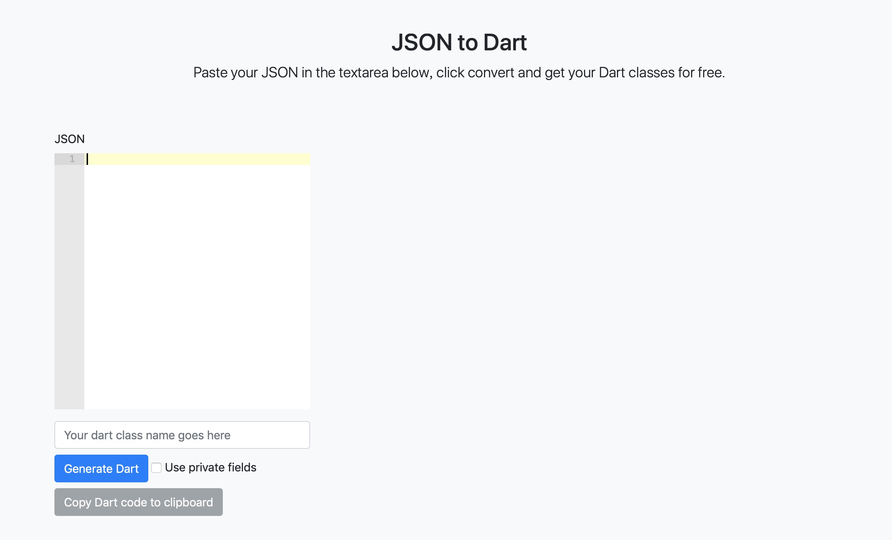
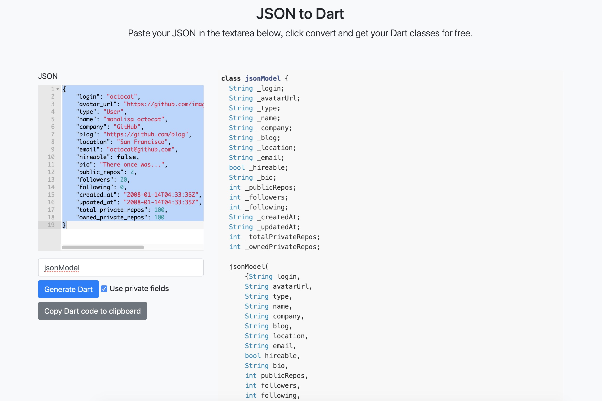
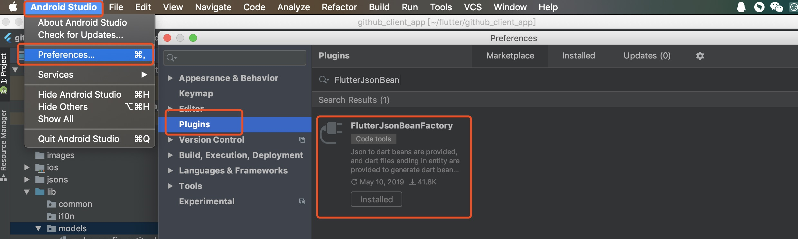

Flutter开发之JSON解析
===========================
在实战中，后台接口往往会返回一些结构化数据，如JSON、XML等。下面就一起学习一下Flutter的JSON解析。
JSON(JavaScript Object Notation, JS 对象简谱) 是一种轻量级的数据交换格式。它基于 ECMAScript (欧洲计算机协会制定的js规范)的一个子集，采用完全独立于编程语言的文本格式来存储和表示数据。简洁和清晰的层次结构使得 JSON 成为理想的数据交换语言。 易于人阅读和编写，同时也易于机器解析和生成，并有效地提升网络传输效率。

****
1.手动解析
-----------
手动解析通常应用在一些基本简单的场合，即数据结构不是很复杂的场景，可以通过dart:convert中内置的JSON解码器json.decode() 来实现，该方法可以根据JSON字符串具体内容将其转为List或Map，这样我们就可以通过他们来查找所需的值，如：

```Dart
//一个JSON格式的用户列表字符串
String jsonStr='[{"name":"Jack"},{"name":"Rose"}]';
//将JSON字符串转为Dart对象(此处是List)
List items=json.decode(jsonStr);
//输出第一个用户的姓名
print(items[0]["name"]);
```
通过json.decode() 将JSON字符串转为List/Map的方法比较简单，它没有外部依赖或其它的设置，对于小项目很方便。但当项目变大时，这种手动编写序列化逻辑可能变得难以管理且容易出错，例如有如下JSON:

```Dart
{
  "name": "John Smith",
  "email": "john@example.com"
}
```
我们可以通过调用json.decode方法来解码JSON ，使用JSON字符串作为参数:
```Dart
Map<String, dynamic> user = json.decode(json);

print('Howdy, ${user['name']}!');
print('We sent the verification link to ${user['email']}.');
```
具体的可以参考 [https://book.flutterchina.club/chapter11/json_model.html](https://book.flutterchina.club/chapter11/json_model.html)。

2.在线生成
-----------
打开JSON to Dart网站[https://javiercbk.github.io/json_to_dart/](https://javiercbk.github.io/json_to_dart/)



把JSON数据拷贝到输入框中，填写类名，然后点击Generate Dart按钮，生成出来的json类就在图的右边，在项目里创建Dart数据类直接把生成出来的复制过去就行了



3.Json_model包
-----------
参考  [Json_model](https://github.com/flutterchina/json_model)

安装

```Dart
dependencies:
json_annotation: ^2.0.0


dev_dependencies:
json_model: #最新版本
build_runner: ^1.0.0
json_serializable: ^2.0.0

```
使用

1. 在工程根目录下创建一个名为 "jsons" 的目录;
2. 创建或拷贝Json文件到"jsons" 目录中;
3. 运行 pub run json_model (Dart VM工程)or flutter packages pub run json_model(Flutter中) 命令生成Dart model类，生成的文件默认在"lib/models"目录下。

使用Json_model包时，在.json文件里不能有注释，否则会报错，json数据的key名字里不能有_否则z转完会报错


4.FlutterJsonBeanFactory插件
-----------
使用FlutterJsonBeanFactory插件来辅助生成Bean类。
安装方法:在Android Studio里依次选择【Android Studio】->【Preferences…】->【Plugins】，然后搜索FlutterJsonBeanFactory插件安装即可，如图:


